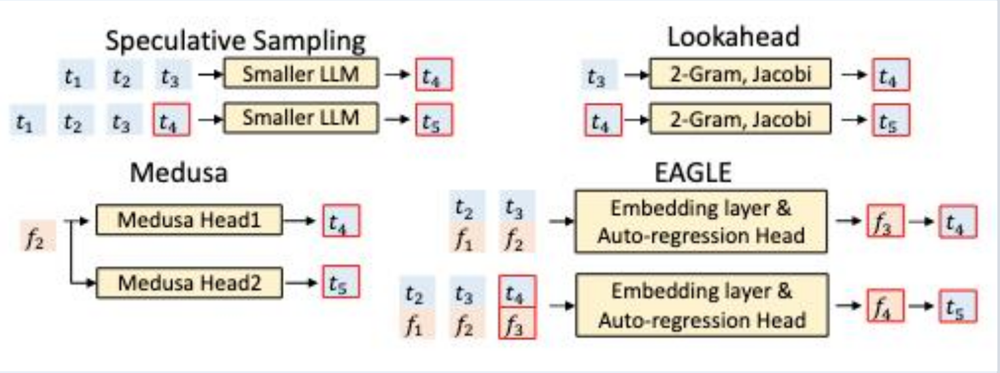
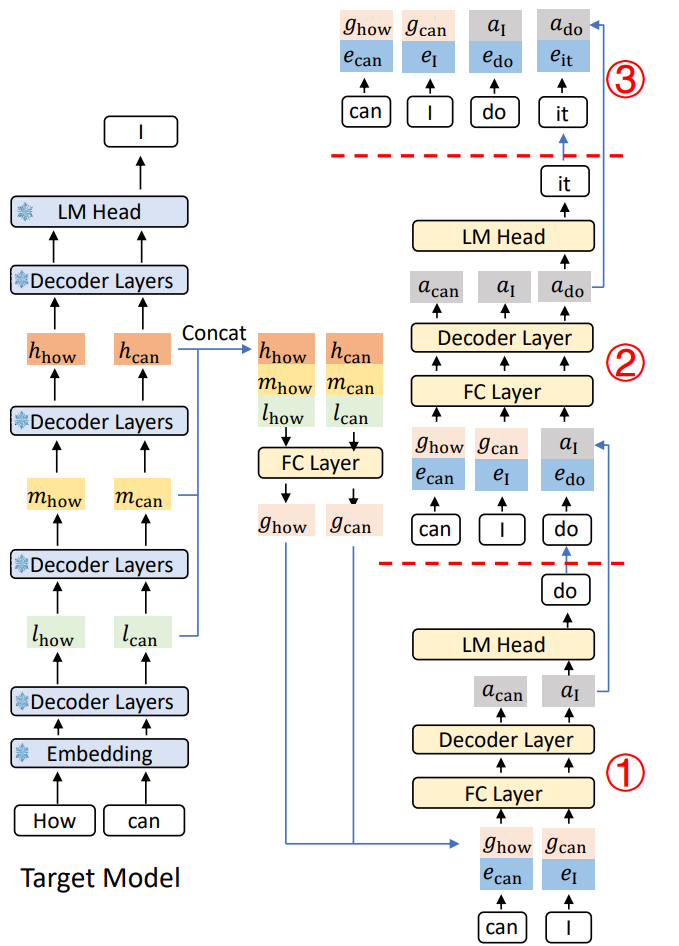
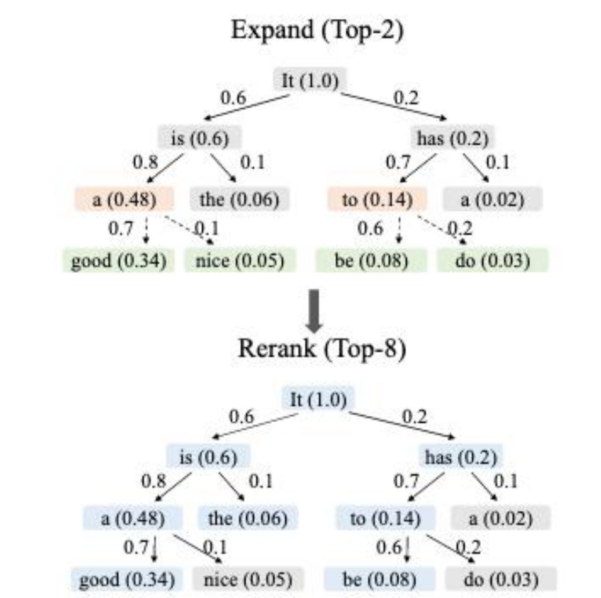
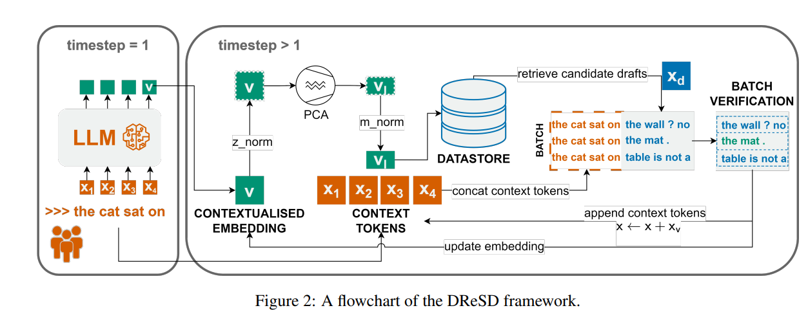
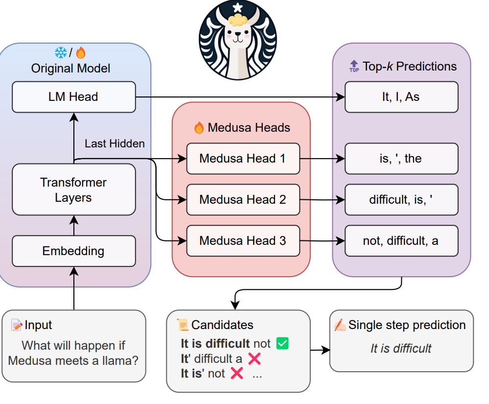
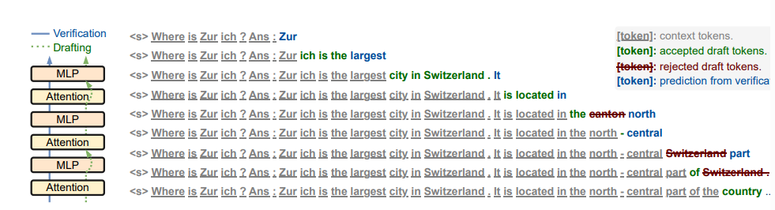
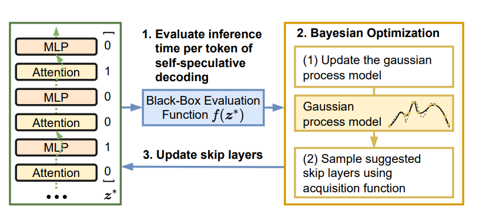
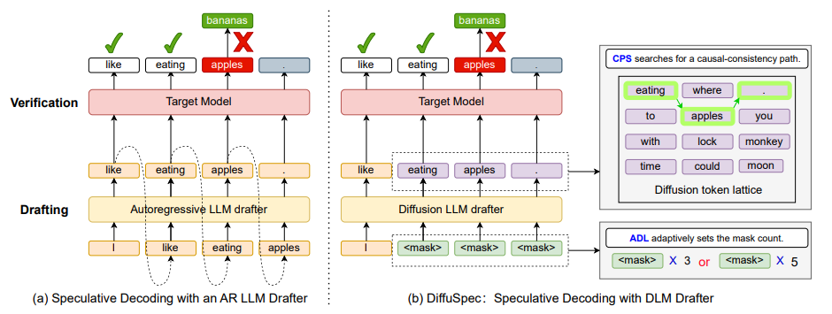
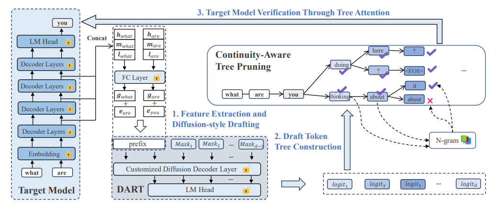

# Final-project

> **形式**:复现 + 改进  ·  **组队**:2–3 ·  **截止日期**:6.19 ·  **提交形式**:PDF报告+代码

---
## 目录

- [第一部分 背景：为什么需要投机解码](#第一部分-背景为什么需要投机解码)
- [第二部分 当前投机解码设计空间（帮助理解当前SD主流技术）](#第二部分-当前投机解码设计空间从3个优化目标视角--帮助理解当前sd主流方法)
  - [1.设计空间总览表](#第二部分-当前投机解码设计空间从3个优化目标视角--帮助理解当前sd主流方法)
  - [2. 基于已有工作优化思路的展开介绍](#2-基于已有工作优化思路的展开介绍)
    - [A. 提高 draft 质量](#a-提高-draft-质量)
      - [A1. Feature-level / token-level autoregressive drafter（EAGLE 路线）](#a1-feature-level-token-level-autoregressive-drafter-eagle-路线)
        - [（1）EAGLE-1](#1eagle-1neurips24)
        - [（2）EAGLE-3](#2eagle-3iclr25--2025)
      - [A2. Context-aware dynamic draft tree（EAGLE-2）](#a2-context-aware-dynamic-draft-tree-eagle-2-的关键贡献)
      - [A3. Dense retrieval-based drafter](#a3-dense-retrieval-based-drafter-rest--dresd)
    - [B. 降低 drafting latency](#b-降低-drafting-latency)
      - [B1. 多 decoding head 并行 drafting](#b1-多-decoding-head-并行-draftingmedusa)
      - [B2. Self-speculative：drafter 与 verifier 共享同一模型](#b2-self-speculativedrafter-与-verifier-共享同一模型)
      - [B3. Non-AR drafter（diffusion-style）](#b3-non-ar-drafterdiffusion-styldiffuspec--dart)
    - [C. 优化 verification 结构](#c-优化-verification-结构)
      - [C1. Tree attention（静态树）](#c1-tree-attention静态树)
      - [C2. Dynamic / context-aware draft tree](#c2-dynamic--context-aware-draft-tree)
      - [C3. Traversal Verification](#c3-traversal-verification)
  - [3. 小结](#3-总结)
- [第三部分 投机解码组件分解（D1–D7）：可选的优化点](#第三部分-投机解码组件分解)
  - [D1 · drafter 的模型设计与来源](#d1--drafter-的模型设计与来源)
  - [D2 · drafter 的生成方式](#d2--drafter-的生成方式)
  - [D3 · drafter 与 target 的信息耦合度](#d3--drafter-与-target-的信息耦合度)
  - [D4 · drafter–target 的输出对齐方式](#d4--draftertarget-的输出对齐方式)
  - [D5 · draft 的输出结构](#d5--draft-的输出结构)
  - [D6 · draft 长度决策](#d6--draft-长度决策)
  - [D7 · verify 规则](#d7--verify-规则)
  - [组件分解总览](#总结)
- [第四部分 投机解码实验要求](#第四部分-投机解码实验要求)
- [第五部分 自主选择主题的project实验要求](#第五部分自主选择主题的project实验要求)

---

## 第一部分 背景:为什么需要投机解码

**Decode 是 memory-bound 的**。自回归生成每吐一个 token 都要把整套权重从 HBM 过一遍;batch=1 的解码阶段算术强度极低,GPU 利用率常常只有峰值算力的几个百分点,真正的瓶颈是带宽而非算力。硬件趋势上,算力增长远快于带宽,这个缺口只会越来越大。

**投机解码的思路**:

1. 用一个便宜的 **drafter**(小模型 / 头 / 草稿模块)先猜出未来 γ 个 token;
2. 把 "prefix（其实是免费的，因为已经缓存了KV） + 草稿" 一次性送进 target,**并行**计算 γ+1 个位置的 logits;
3. 用拒绝采样逐位置验证,接受最长前缀,在第一个被拒的位置由 target 重新采一个 token。

**两个关键性质**:
- **无损**:拒绝采样意义下输出分布与直接用 target 解码完全等价。
- **期望接受长度 > 1**:一次 target forward 可接受多个 token,把 拉取权重一次 的带宽成本摊薄到多个输出上。

本质上,投机解码是把训练阶段的并行性应用到推理阶段;之所以可行,是因为小模型和大模型的 top-1 在相当一部分 token 上一致(模板词、上下文复制等),只在难位置才分叉。相比量化/蒸馏需要精度取舍,投机解码理论上**不改输出分布**,可以直接上线。

---

## 第二部分 当前投机解码设计空间（从3个优化目标视角）--帮助理解当前SD主流方法
## 1. 设计空间总览表

| 设计维度 | 优化目标 | 具体优化思路 | 关键技巧 | 代表工作 |
|---|---|---|---|---|
| **A. 提高 draft 质量** (让更长的草案被接受) | 最大化 acceptance rate / accepted length | **A1. Feature-level autoregressive drafter** | 在 target model 倒数第二层 hidden feature 上做 AR，而非在 token 上做 | EAGLE、EAGLE-2、EAGLE-3 |
| | | **A2. Context-aware dynamic draft tree** | 用 draft model confidence 近似 acceptance，动态决定 expand / rerank | EAGLE-2 |
| | | **A3. Dense retrieval-based drafter** | contextualized embedding + ANN 检索代替精确字符串匹配 | DReSD（对比 REST） |
| **B. 降低 drafting latency** (让"提案本身"足够便宜) | 把"提一个 K-token 草案"的 wall-clock 时间压到极致 | **B1. 多 decoding head 并行 drafting** | 在 backbone 顶部加 K 个并行 head，一次 forward 出 K 个未来 token | Medusa-1 / Medusa-2 |
| | | **B2. Self-speculative：drafter ≡ verifier** | 跳过部分中间层 / 早退做 draft，整套网络做 verify，无 auxiliary model | Draft & Verify、LayerSkip |
| | | **B3. Non-AR drafter（diffusion-style）** | 用 diffusion LM 在单次 forward 中并行预测多个 masked 位置 | DiffuSpec、DART |
| **C. 优化 verification 结构** (让一次验证覆盖更多候选) | 把 target model 单次 forward 的"打分预算"摊到尽量多的候选 token 上 | **C1. Tree attention（静态树）** | 用因果 mask 把 K 条候选续写拼成一个 batch，1 次 forward 同时打分 | Medusa、EAGLE-1 |
| | | **C2. Dynamic / context-aware draft tree** | 在线根据 draft confidence 决定树形状，剪掉低收益分支 | EAGLE-2 |
| | | **C3. Traversal verification（全局接受准则）** | 不在首个拒绝点截断，而是从路径整体接受率视角采样 | Traversal Verification |

---

## 2. 基于已有工作优化思路的展开介绍

### A. 提高 draft 质量

这一维度的核心 KPI 是 **acceptance rate** α（单个 draft token 被 target model 接受的概率）以及 **accepted length**（一次草案中实际通过的连续 token 数）。它直接决定 SD 的理论加速比上限 —— 若 drafter 提的 K 个 token 几乎全被拒，前面所有 drafting 开销都是浪费。

#### A1. Feature-level /token-level autoregressive drafter（EAGLE 路线）

##### （1）EAGLE-1(NeurIPS'24)

**论文**:*EAGLE: Speculative Sampling Requires Rethinking Feature Uncertainty*

**关键观察**
- 传统投机解码用"小 LM 直接预测下一个 token"。EAGLE 的洞察是:**直接预测 token 难,因为 token 空间是高熵离散的**;而 target 模型 **second-to-top layer** 的 hidden feature 信息更稠密、更平滑,且观察发现由于语义平滑,相邻 token 的 feature 是比较接近的,**在 feature 空间做自回归更容易学**。
- 但 feature prediction 仍存在 **uncertainty**(真实部署中,生成token一般是temperature sample或top-K sampling的,所以同一 feature 会对应多个合理预测的 token,同一个$f_t$
在数据里对应多个不同的$f_{t+1}$)。

**做法**:额外增加**锚点 token embedding**作为输入,缓解 feature 预测的不确定性。

**Drafter 的结构**

`Drafter = Embedding Layer (复用 target 模型的) 
        + 1 层 Transformer Decoder (Auto-regression Head)
        + LM Head (复用 target 模型的)`

**注意:**
1. Embedding Layer 和 LM Head 都直接复用 target 大模型的,不重新训; 真正新增的可训练参数只有 1 层 Transformer 的权重,极小。
2. 要预测t+1位置的feature,EAGLE的输入是 **"t+1位置的 token 的 embedding" + "t位置的 second-to-top-layer feature"**,即额外塞一位**提前一位的 token 序列**作为锚点,缓解 feature 预测的不确定性。
3. 输出 next feature,再过 target 的 LM head 得到 next token;自回归循环 γ 次得到草稿。
4. 校验阶段使用拒绝采样,理论无损。

**报告效果**:LLaMA2-Chat 70B 上 **2.7×–3.5×** 端到端加速。

##### （2）EAGLE-3(ICLR'25 / 2025)

**论文**:*EAGLE-3: Scaling up Inference Acceleration of Large Language Models via Training-Time Test*,放弃 feature prediction,改为 direct token prediction, 并使用 multi-layer feature fusion + training-time test。

**关键观察**
- EAGLE-1/2 的 drafter 学的是 **feature regression**,接受长度随草稿步数 γ 增长很快**饱和** —— 因为 feature 误差会逐步累积。
- 单层 feature(second-to-top)信息量有限,丢失了浅层的局部信息和深层的抽象语义。

**做法**
1. **放弃 feature prediction,改为 direct token prediction**:`[g_t (融合 feature) OR a_t (drafter 自己的状态) ， embed(x_{t+1})]  →  drafter  →  logits `,drafter 直接预测 token logits。
2. **Multi-layer feature fusion**:从 target 的 low/mid/high 三层 feature 拼接进 drafter 输入,信息更丰富。
3. **Training-time Test(TTT)**:训练阶段就模拟多步 draft-verify 循环,让 drafter 在自己输出导致的真实分布上学习,**显著缓解 train-test gap**,从而打破接受长度随 γ 饱和的瓶颈。//: EAGLE-1/2都是单步训练的,给drafter真实无噪声的($f_t$,$x_{t+1}$)->$f_{t+1}$,但推理是自回归γ步,每步用上一步自己预测的feature作为下一步输入,所以存在train-test-gap
4. 与 EAGLE-2 的 dynamic tree 完全兼容。

**报告效果**:
- 端到端最高 **6.5×** 加速;
- 接受长度随草稿规模 **持续单调增长**(EAGLE-2 早早饱和在 ~4.2,EAGLE-3 可达 6+);
- 在 LLaMA-3.1-8B / 70B、DeepSeek-R1-Distill 等主流模型上均有公开权重。

#### A2. Context-aware dynamic draft tree（EAGLE-2 的关键贡献）

##### （1）EAGLE-2(EMNLP'24)

**论文**:*EAGLE-2: Faster Inference of Language Models with Dynamic Draft Trees*,是EAGLE-1的工程优化版,完全不重训drafter,只改打草稿的构造策略(EAGLE-1 默认链式草稿,即step只草拟一条线性 token 序列(如:$x_6 → x_7 → x_8 → x_9$),target 验证时从左到右逐位拒绝采样,一旦在某个位置被拒,后面全作废)。

**关键观察**
- 传统链式草稿只要其中某个token被拒绝,后面整条草稿都废了,使得接受率上限被卡住。
- 传统树式草稿(SpecInfer 等)使用**静态**草稿树,每个位置展开固定的 top-k,所以每棵草稿树的形状都一样,不随着上下文变化。
- 实验发现:**token 在草稿树中的接受率不仅取决于树中位置,还强烈依赖上下文**。例如 "It is" 之后 "a" 接受率很高,而 "It has" 之后 "a" 的接受率却低得多。**静态结构浪费了校验预算**(如某些节点几乎已经不可能被接受了,应该不再展开token)。

**做法**
1. 用 **drafter 自身的 confidence(softmax 概率)** 作为 acceptance 的近似。
2. 两阶段构造 **context-aware dynamic draft tree**:
   - **Expand**:按当前节点 confidence 选 top-k 扩展;
   - **Rerank**:对整棵候选树按"路径累计 confidence"重排,只保留总共 top-N 个节点参与 target 校验,同时保证保留的节点构成一棵连通子树(被选中的节点的所有祖先必须也在内,这样 attention mask 才有效)。
3. 需要配合对应的 tree attention mask(每个节点只能 attend 它自己的祖先链),一次 target forward 同时校验整棵树。

**报告效果**:**3.05× – 4.26×**,在不重训 drafter 的前提下相对 EAGLE-1 再提升约 20–40%。
> 总结:**EAGLE-1 把 drafter 从 token 空间挪到了 feature 空间;EAGLE-2 让校验树看上下文动态调整;EAGLE-3 把 drafter 训练目标和推理过程对齐,并让 drafter 看到更多层 feature 且避免累积误差。**

#### A3. Dense retrieval-based drafter（REST → DReSD）
这类工作属于**检索式推测解码**，草稿模型不是一个小模型，而是一个非参数化的数据存储库（datastore）——根据当前上下文从中查出"下面可能要生成的若干 token"。目前主流方法是 REST（稀疏检索），它**用 datastore 替代小模型**，对当前上下文做 longest-suffix exact match retrieval，从检索到的 continuation 里构 Trie，挑高频前缀作为 draft，再喂 target model 并行验证。它在代码生成这类高度复现的场景中非常有效。

**REST 的两个短板**：
1. **短上下文**：suffix 匹配 window 不能太长，否则命中率很低；
2. **exact string matching**：泛化能力差，精确字符串匹配过于刚性，上下文里只要有一点微小扰动（多一个空格、换个同义词），就完全检索不到本来很相关的序列。

**DReSD 的改进**：
- 把检索 key 从 token 字符串换成 **contextualized token embeddings**（来自 LLM 本身的中间层激活）；
- 用 **近似最近邻 (ANN)** 在向量空间里找语义最接近的上下文，再把那些上下文后面跟着的 token 序列作为草稿（这样语义近邻也能命中，更长的语义上下文也能编码进 query）；

>**实现思路**：整体是一个即插即用的框架，主循环逻辑：1. prompt送入LLM获取 token embedding; 2.将该embedding各维度进行Z-score 归一化（均值和方差从当前所有语料中采样多个的 token embedding 估计。）; 3.PCA 降维（LLM hidden state 通常有 4096~5120 维，直接使用整个特征进行稠密检索会有很多冗余，论文发现只保留 64 维就能捕获 30%~40% 的方差，并实现强检索性能（MRR > 93%））; 4.把降维后的向量缩放到单位长度，方便做点积/余弦相似度; 5.使用处理后的 embedding 为 key 到数据存储库检索（这里还可以用之前从LLM前向拿到的 x_{t+1} 过滤掉首个 token 不匹配的草稿，进一步提升精度）。

原文报告：相对 REST，**平均 acceptance 更高、accepted tokens 更长、速度更快**。整条 retrieval-based 路线最大的优点是 **drafter 完全 non-parametric**，新领域只需更新 datastore，不必再训练。

---

### B. 降低 drafting latency

A 路线的隐含假设是"drafter 比 verifier 便宜很多，所以多花点 drafter 时间换 acceptance 是值的"。但是当 drafter 自己变成瓶颈（例如 70B 用 7B 当 drafter，K=8），SD 的实际加速比会被 drafting 时间拖累。这个优化维度的核心就降低 drafting latency。

#### B1. 多 decoding head 并行 drafting（Medusa）

**动机**：vanilla SD 的 drafter 是一个独立、AR 生成的小 LM，要跑 K 次 forward 才能拿到 K 个 draft token。Medusa 直接砍掉 drafter，**在 backbone 顶部并联多个 decoding head**，每个 head 负责预测 "+1, +2, …, +K" 这些位置的 top-k 候选，**一次 forward 出 K 个未来 token 的 top-k**。

**实现思路**：
- 每个 head 是一个轻量 MLP，从 backbone 最后一层 hidden 出发，独立预测对应位置top-k；
- 候选不是单一序列，而是 K 个位置 × 每个位置 top-k 的 **笛卡尔积** —— 需要配合 **tree attention** 验证；
- **Medusa-1**：冻结 backbone，只训 heads；**Medusa-2**：联合训练，acceptance 更高但训练成本更大。

**特点**：drafting latency 几乎等同于一次 backbone forward，比独立 small LM 快得多；代价是 heads 之间**无 inter-position dependency**，预测 +2 时不知道 +1 实际取了什么 token，因此 acceptance rate 弱于 EAGLE 这类 AR drafter。这就是为什么后续工作（EAGLE）会回到 AR 但在 feature 层做。

#### B2. Self-speculative：drafter 与 verifier 共享同一模型

**动机**：再轻量的额外 drafter，部署侧仍需多一份显存存它的权重。**自推测解码（Self-speculative decoding）** 的思想是：完整 LLM 跳过部分中间层后，本身就是一个不错的 drafter。

**两条具体路线**：

- **Draft & Verify (Zhang et al., ACL 2024)**：

  - 不需 auxiliary model、不增加额外显存、输出与原模型分布一致；
  - drafting 阶段**跳过部分中间层**（哪些层跳由 **贝叶斯优化（Bayesian Optimization）** 自动搜出最优 skip-layer 组合，目标函数是在验证集上，使用跳层方案 z 进行自推测解码时，每个被验证通过的 token 的平均推理时间最小）；
  - verification 阶段用完整 LLM 一次性 batch 打分。

- **LayerSkip (Elhoushi et al., 2024)**：LayerSkip 同时改造训练和推理，专门让模型学会在浅层就能输出合理结果，然后在推理时把这个能力用到极致
  - 训练侧：**layer dropout（后层 dropout 更高）+ early exit loss（将中间层的hidden state也过同一个LM_head预测并计算交叉熵作为辅助损失）**，Layer dropout 让模型在训练时就经历过后层缺少的情况，推理时直接砍掉不会崩，Early exit loss 让浅层 hidden state 主动对齐到 LM_head 能解读的方向，适应早退预测。
  - 推理侧：早退既可以直接输出（减少全模型 forward），也可以作为 self-spec 的 draft stage，后面让完整模型 verify；
  - draft / verify **共享计算与激活**（draft 阶段 forward 的前若干层结果可被 verify 阶段直接复用），内存占用更低。

**特点**：B2 这一路线工作的关键不是快多少，而是**不需要训练或部署第二份模型** ，对那些不能改部署形式的生产线非常友好。

#### B3. Non-AR drafter（diffusion-style：DiffuSpec / DART）

**动机**：把 drafter 直接换成 **diffusion language model (DLM)**，就可以**在单次 forward 里同时预测多个 masked position 的 logits**，drafting latency 直接掉一个量级。

- **DiffuSpec**：（Li et al., 2025, arXiv 2510）

  - 直接把 pretrained DLM 当 drafter，使得单次 forward 产生多 token draft；
  - 因为DLM是块内双向 attention的，而AR模型的概率分布是严格左到右的因果 attention，为兼容 AR verifier，引入两个机制：
    - **CPS (Causal-consistency Path Search)**：每个位置保留 top-M 个候选 token（论文里用 mass-adaptive 剪枝，按累积概率 0.8 自动决定 M 的大小，最多不超过 M_max），再从中拣出一条因果连贯的路径（可细看它对候选路径的打分函数设计），使得它在 AR verifier 视角下有意义；
    - **ADL (Adaptive Draft Length)**：根据置信度动态决定该次提多长（简单的地方接受率高可以多提，难的地方少提）。
  - 原文报告：up to 3× wall-clock 加速。

- **DART**：

  - 受 diffusion 启发，但不是简单复用现成 DLM，DART自己设计、训练一个超轻量级的 draft layer；
  - 拿 target model 的中间层 hidden states（low / middle / high 三个层级的特征）concat 作为输入，使用 fully connected 投影 + 一层 Transformer decoder + LM head，在单次 forward 中并行预测多个未来 masked positions 的 logits；
  - 再做 **tree pruning**，并用 **N-gram-enforced semantic continuity** 来约束并行预测之间的连贯性 （non-AR drafter 的核心痛点）；
  - 原文报告：2.03×–3.44×，平均优于 EAGLE-3。

---

### C. 优化 verification 结构

verification 是 target model 自己跑一次 forward，期望**它在同样的 KV/算力预算下尽量多打分**。

#### C1. Tree attention（静态树）

**动机**：如果 drafter 一次只给一条候选续写，target model 一次只能验证一条。换成"多条候选共享前缀"的树形结构，再加一个**因果 mask**让不同候选互不影响，target model **一次 forward 同时给所有候选打分**，单位算力的覆盖率成倍提升。

**实现思路**：
- 一棵 draft tree 中，每个节点是一个候选 token，从根到叶是一条 continuation；
- attention mask 设计为：节点 v 只能看见它的祖先（保持因果性），不能看见兄弟分支；
- target model 一次 forward 之后，按 modified rejection sampling 沿树自顶向下找最长被接受前缀；
- 代表工作：Medusa（笛卡尔积型树）。

#### C2. Dynamic / context-aware draft tree、

C1 用的是**形状预先决定的静态树**。EAGLE-2 是把树**做成在线动态的**：

- 在 expand 阶段，用 draft model confidence 近似该分支被 verifier 接受的概率，concentrate budget；
- 在 rerank 阶段，从已 expand 出来的候选里，挑期望接受长度最大的 top-K 喂给 verifier。

#### C3. Traversal Verification

**动机**：标准 modified rejection sampling 是**逐 token、从左到右**的：一旦碰到一个拒绝概率高的 token，就在那里截断，后面 draft 全废。但是从全局看，这条路径**剩余 token 的接受概率可能很高** —— 也就是说"局部一个高拒绝点把整条本来还不错的路径毁掉了"。

**核心问题**：能否从**更全局**的角度采样，而不是被首个高拒绝点 short-circuit？

Traversal Verification 提出沿整条路径计算/比较累积的接受概率，让某些短前缀单看会被拒、但**长前缀整体接受率高**的路径有机会通过。在 Chain / Binary Tree / EAGLE Sparse Tree 三种 verification 拓扑下，Traversal Verification (Tra.V) 相对 token-wise verification (Tok.V) 在 acceptance length 和 throughput 上都有稳定提升。

---

## 3. 总结

1. **三个优化目标是正交的**：A 改善的是draft准确度，B 改善的是draft latency，C 改善的是验证效率。
2. **一篇工作一般只会覆盖其中一到两个目标**：例如
   - **EAGLE 系列**：主攻 A（feature-level AR）+ 顺带 C（dynamic tree, EAGLE-2）；
   - **Medusa**：主攻 B（多 head 并行 drafting）+ 顺带 C（笛卡尔积 tree attention）；
   - **Draft & Verify / LayerSkip**：纯 B（self-spec，把 drafter 成本压到零）；
   - **REST / DReSD**：A（DReSD 改善 retrieval 命中）+ B（non-parametric drafter，no 训练）；

---

## 第三部分 投机解码组件分解

> 每个维度对应一个独立的瓶颈，列出了常见技术（✅）和尚未充分探索/已有但未开源的方向（🆕）。
> 维度之间通常正交，可自由组合做优化。

---

## D1 · drafter 的模型设计与来源

> **瓶颈**：drafter 单次 forward 的成本。
> drafter 越大质量越高但越慢，越小越便宜但接受率低，需要找平衡点。

### ✅ 常见技术

| # | 技术 | 代表方法 | 特点 |
|---|---|---|---|
| 1 | 独立预训练小 LLM | Leviathan 2023, Chen 2023 | 简单粗暴，training-free |
| 2 | target 的子集（跳层 / 前 E 层）| Self-SD, LayerSkip | 零额外参数，KV cache 可复用 |
| 3 | target hidden state 上接超轻量 layer | EAGLE, DART | 低成本，需要训练 |
| 4 | target 上接 K 个并行 head | Medusa | 并行但 head 间独立 |
| 5 | datastore + 检索引擎 | REST, DReSD| 零神经网络计算 |
| 6 | 外部 DLM | DiffuSpec | 一次出多 token 但本身重 |
| 7 | 无独立 drafter（Jacobi 迭代） | Lookahead Decoding | 同模型做不动点迭代 |

### 🆕 新点/未开源的复现

- **MoE-style drafter**：根据 prefix 难度动态选择不同 drafter（简单内容走 datastore，复杂内容走 EAGLE-layer）。
- **多层级 drafter**：第一级 datastore 出粗稿 → 第二级 EAGLE-layer 修正成精稿，两级都比 verify 便宜。
- **Target attention head 子集 drafter**：不跳整层，只用 target 的某几个 attention head——sparse attention 已有相关研究但没用到 drafter 上。

---

## D2 · drafter 的生成方式

> **瓶颈**：drafter 内部的串行性。
> 即便单步便宜，K 步串行也会累积延迟。

### ✅ 常见技术

| # | 技术 | 代表方法 | 串行步数 |
|---|---|---|---|
| 1 | 纯 AR | EAGLE, LayerSkip | K 步 |
| 2 | 多 head 并行 | Medusa | 1 步（head 间独立）|
| 3 | DLM 双向并行 | DiffuSpec | 少量去噪步（双向 attention）|
| 4 | DLM-inspired causal 并行 | DART | 1 步（因果对齐的 logits）|
| 5 | 检索式 | REST, DReSD | 0 步 |

### 🆕 新点/未开源的复现

- **AR + 并行混合**：前 2 步 AR（保证早位置因果性强），后 K-2 步并行。
  - 来自 DART "早位置最重要" 的洞察推论。
- **少步 diffusion refinement**：1 次并行出粗稿 + 1 次修正，共 2 次 forward。
  - 介于"纯并行（1 次但质量差）"和"纯 AR（K 次但质量好）"之间。
- **检索 + 修正**：从 datastore 查粗稿 → 轻量 layer 局部修正几个 token。

---

## D3 · drafter 与 target 的信息耦合度

> **瓶颈**：因为需要保持Target的输出分布，所以接受率的理论上限是瓶颈。
> drafter 用 target 的多少内部信息，直接决定它能多准。

### ✅ 常见技术

| # | 耦合程度 | 技术 | 代表方法 |
|---|---|---|---|
| 1 | 完全解耦 | 仅看 prefix token | Leviathan, DiffuSpec |
| 2 | 弱耦合 | 共享 token embedding | 部分蒸馏设置 |
| 3 | 中耦合 | 用 target 最后一层 hidden state | Medusa |
| 4 | 强耦合 | 用 target 多层 hidden state（low/mid/high）| EAGLE-3, DART |
| 5 | 参数级耦合 | 用 target 自身参数（跳层）| Self-SD, LayerSkip |
| 6 | KV 级耦合 | 共享 KV cache | LayerSkip |

### 🆕 新点/未开源的复现

- **用 target 的 attention pattern**：drafter 看 target 上一轮 forward 时哪些 head 关注了哪些位置——信号高度信息化但**未被利用**。
- **用 target 的 logits 历史**：drafter 不只看 hidden state，还看 target 上一轮的 top-k 分布（不只是 argmax token），可以传递"犹豫程度"信号。
- **跨层 hidden state 的注意力混合**：DART/EAGLE-3 用的是简单 concat，能否让 drafter 主动 attend 到 target 的所有层？

---

## D4 · drafter–target 的输出对齐方式

> **瓶颈**：接受率。
> drafter 分布 $q_\phi$ 与 target 分布 $p_\theta$ 越接近，接受率 $\min(1, p_\theta/q_\phi)$ 越高。

### ✅ 常见技术

| # | 技术 | 代表方法 | 关键设计 |
|---|---|---|---|
| 1 | 无显式 train-time 对齐 | Leviathan, DiffuSpec | 完全靠 drafter 自身能力 |
| 2 | One-hot 蒸馏 | 早期 distillation | 学 ground-truth token |
| 3 | feature regression + token CE | EAGLE-1 | 学 target 完整分布 |
| 4 | annealed KL | DART | 早位置权重高（γ=0.6）|
| 5 | 训练时改造 target | LayerSkip | layer dropout + early exit loss |
| 6 | 隐式对齐（target 输出建库）| DReSD 的 ID datastore | 用 target 自己输出做检索库 |

### 🆕 新点/未开源的复现

- **拒绝感知蒸馏（Rejection-aware distillation）**：训练时模拟 verify 过程，**不优化每位置分布像不像 target输出（KL），而是直接优化整条 draft 期望能被接受多少个 token。**——RL 风格目标。
- **对齐特定 test-time 分布**：让 drafter 不仅对齐预训练分布，还对齐特定温度/top-p 设置下的 target——对部署很关键，因为线上 T 通常不是 0。

---

## D5 · draft 的输出结构

> **瓶颈**：单条路径的脆弱性。
> 链式 draft 一拒即断，多路径结构能用 tree attention 同时验证多条候选。

### ✅ 常见技术

| # | 结构形式 | 代表方法 | 特点 |
|---|---|---|---|
| 1 | 单链 | Leviathan, REST, DiffuSpec | 最简单，但脆弱 |
| 2 | 笛卡尔积型对称树 | Medusa | 完全对称，缺因果性 |
| 3 | AR 展开型不对称树 | EAGLE-1 | 每条分支真实因果展开 |
| 4 | N-gram 剪枝型并行树 | DART | 一次 forward + 剪枝 |
| 5 | lattice → 路径搜索压成链 | DiffuSpec | lattice 本身没被直接 verify |
| 6 | trie / DAG（多前缀合并）| 部分检索方法 | 复用共同前缀的 verify 计算 |

### 🆕 新点/未开源的复现

- **lattice 作为 verify 输入**：DiffuSpec 把 lattice 压成链才 verify，**但 lattice 本身就可以作为 verify 输入**——设计好 attention mask 让 target 在 lattice 上跑一次 forward，让 target 自己挑路径，比 n-gram 预筛更准。
- **DAG draft**（分支可汇合）：传统树两个分支永远分叉，但两条不同前缀可能引向同一后续 token——允许 DAG 能复用 verify 计算。
- **层级 draft（粗 + 细）**：先生成粗树（每位置 top-3）→ verify → 在被接受路径上扩展细子树。**两段式 draft**。

---

## D6 · draft 长度决策

> **瓶颈**：drafting 成本与接受率的平衡。
> 提太短没赚到，提太长后面被拒等于白算。

### ✅ 常见技术

| # | 决策依据 | 代表方法 |
|---|---|---|
| 1 | 固定长度 | 大部分早期方法 |
| 2 | drafter 自身置信度 | LayerSkip 的 adaptive draft-exiting |
| 3 | 历史接受率反馈 | DiffuSpec 的 ADL|
| 4 | token 类型（标点/空格短一点）| 部分工作 |

### 🆕 新点/未开源的复现

- **基于 prefix 难度的自适应**：用超轻量分类器（甚至 n-gram entropy）评估"当前 prefix 后面好不好预测"——难预测就提短。
- **基于 verify 成本反馈的 controller**：观察过去几轮接受率曲线（不是单点），用 PID-style controller 动态调长度。
- ⭐**DDD(Dynamic Depth Decoding，动态深度)**:EAGLE-2 的 beam search 固定走 6 步;DDD 改成最多走 11 步,但在第 5、7、9 步检查 beam 整体置信度 $H = \log\sum_i \exp(\text{logprobsum}[i])$,如果低于阈值就提前停。（可以直接复用 EAGLE-2/3 的 drafter 权重,只在推理循环里加了「检查 beam logprobsum 是否低于阈值」的逻辑）。参考：https://arxiv.org/pdf/2409.00142
- ⭐**OPT-Tree:最优树形状**：把 留哪些节点送验证 从启发式排序换成最大化期望接受长度的优化目标。每个节点对期望接受长度的贡献 = 路径累积 drafter 概率,整棵树的期望接受长度就是所有节点贡献的总和:
$\mathbb{E}[\text{acceptance length}] = \sum_{v \in T} \prod_{u \in \text{path}(v)} q(u)$
，先 over-expand 出一棵大树(超过节点预算),然后按根到该节点的路径累积概率全局排序,贪心选 top-N 节点,再保证选中节点构成连通子树送入验证（可以直接基于EAGLE仓库做）。参考：https://arxiv.org/pdf/2406.17276

---

## D7 · verify 规则

> **瓶颈**：
> 同样一条 draft，不同 verify 规则能接受的 token 数差别很大。

### ✅ 常见技术

| # | 技术 | 代表方法 | 特点 |
|---|---|---|---|
| 1 | Token-wise modified rejection sampling | Leviathan 标准 | 简单，但被局部点 short-circuit |
| 2 | Tree attention verification | Medusa, EAGLE, DART | 树形 draft 的标配 |
| 3 | Block verification | EMS-SD, n-grammys | 一次验证多个 token |
| 4 | Typical acceptance | Medusa | 放宽接受条件（有损）|
| 5 | Traversal verification | Tra.V | 路径全局接受 |
| 6 | Optimal transport based | SpecTr | 从严格采样视角优化 |

### 🆕 新点/未开源的复现
- **Speculative verification**：verify 本身也"投机"——target 的前若干层快速 reject 明显不行的 token，剩下的才走完整 forward。
- **Block verification 但只跑前缀的 prefix verify**：先 verify 整条 draft 的前 m 个 token（block），如果整块通过就一次性接受，否则退化到 token-wise。

---

## 总结

| 维度 | 瓶颈 | 改动是否需要重训 |
|---|---|---|
| D1 模型来源 | T_draft 单步成本 | 通常需要 |
| D2 生成范式 | T_draft 串行性 | 通常需要 |
| D3 信息耦合 | 接受率上限 | 通常需要 |
| D4 对齐方式 | 接受率 | 需要（除非用 datastore 隐式对齐）|
| D5 输出结构 | 鲁棒性 / 被接受长度 | **通常不需要** |
| D6 长度形状 | 成本-接受率平衡 | **通常不需要** |
| D7 verify 规则 | 被接受长度 | **不需要** |

----
## 第四部分 投机解码实验要求
不要求一定从零构建一个新的投机解码框架（可以不训练drafter），而**在已有工作的基础上做出可验证的改进**。具体要求如下：

**起点选择**：
- 如果你选择从一个公开的基础工作出发，例如 HuggingFace 上的某个 LLM（作为 target model），自己设计drafter结构并训练，那你的baseline可以直接就用纯AR的target model; 
- 如果从一个已有的投机解码实现（如 EAGLE/EAGLE-2/Medusa/LayerSkip 等开源仓库）。不要求再从头训练 drafter，可以直接复用已发布的 checkpoint，做一些推理侧的改进。

**改进点数量要求**：
- **3 人组队**：至少完成 **2 个**优化点的改进；
- **2 人组队**：至少完成 **1 个**优化点的改进。

**改进点的选择**：可以从上文的 **组件维度分解（D1-D7）** 中挑选一个具体的创新点，也可以自己提出优化思路。

**比较建议优先考虑 D5-D7 这三个维度**，因为**D1-D4 通常需要重新训练 drafter**（涉及模型结构、训练目标、对齐方式的改动）；而**D5（draft 结构）/ D6（长度决策）/ D7（verify 规则）多数是推理期的改动**，可以直接复用已有的 drafter 权重，改动集中在推理循环里，工作量会小一些；

**⭐ 标记的优化点**（如DDD、OPT-Tree 等）是**比较推荐**的方向：改动量小、不需要训练、有明确的算法描述可以参照、且可以直接基于 EAGLE 仓库的推理循环修改。如果对项目方向很迷茫，建议从 ⭐ 项中挑选。

**评分关注点**：（评分细则在第五部分）
1. 前期的 profiling 是否定位到了一个真实的瓶颈（在lab1-3中已经有的结论可以直接使用的）；
2. 跑通 baseline（如复现EAGLE工作）
3. 改进点的实现是否正确（尤其是保持分布一致性）；
4. 消融实验（可以比较单个改动是否有用？两个改动是否互补？）；
5. 失败/不 work 的尝试也欢迎写入报告——能说清楚为什么没work也很重要。

---

作业要求体现出**完整的 MLSys 研究**。评分围绕以下四个维度:

1. **识别真实的系统瓶颈** —— 用数据(profiling、测量)
2. **提出针对性的改进** —— 改进与瓶颈之间有清晰的因果关系
3. **实验验证** —— 公平对照、消融
4. **局限性分析** —— 说清楚方法在哪些场景不适用

---

## 第五部分：自主选择主题的project实验要求

### 1.方向的选择

方向不限于:KV cache 管理、批处理与调度、MoE 推理优化、多模态推理、量化/稀疏、早退与级联、算子优化等等——鼓励结合自己研究方向选题。

**不接受作为"改进"的内容**:仅调整超参数、换数据集重跑、换更大模型重跑、不做任何改动只写性能报告。这些可以是复现的一部分,但不构成创新贡献。

---

## 2. 四个评估维度的具体要求

### 2.1 识别真实的系统瓶颈

用**可观测的证据**指出瓶颈在哪。可用的手段包括但不限于:

- PyTorch Profiler、Nsight Systems、`torch.cuda.Event` 测时
- 显存追踪:`torch.cuda.max_memory_allocated`
- 简单的 roofline 估算或 FLOPs 利用率(MFU)
- 各阶段时间占比的可视化(柱状图/饼图)

在报告中应有**图或数据**阐述瓶颈在哪,占了的时间/显存。

### 2.2 提出针对性的改进

改进能回答两个问题:

- **为什么这个改动能解决前面识别出的瓶颈?**
- **改动的代价是什么?**(精度损失、通用性、复杂度等)

### 2.3 实验验证

#### 可参考的核心指标(按课题选取相关项)

| 类别 | 常用度量 |
|---|---|
| 吞吐 | samples/s、tokens/s、queries/s |
| 延迟 | p50/p95、TTFT、单步耗时 | 
| 显存 | peak memory、激活/KV cache 占用 |
| 精度 | 任务指标(acc / PPL / BLEU 等) | 

#### Baseline 设置

可以是:
- **基础的AR模型推理**（Huggingface上下载）
- **参考的论文方法**(你的codebase)

#### 实验

- 对比baseline
- 若改进包含多个组件/子优化,做一次**消融实验**:逐个去掉组件/子优化,看各自贡献

### 2.4 局限性分析

- 改进在哪些场景下**不适用**或收益变小(如不同模型规模、不同 batch、不同硬件)
- 是否存在 trade-off(精度 vs 速度、显存 vs 通信等)

## 3. 评分细则

| 维度 | 权重 | 评分要点 |
|---|---|---|
| 瓶颈识别 | 15% | 是否用数据证据定位真实瓶颈 |
| 改进设计 | 35% | 改进与瓶颈的因果关系是否清晰 |
| 实验严谨性 | 20% | baseline、消融等 |
| 局限性分析 | 10% | 指出方法不适用的场景 |
| 课堂汇报 | 20% | 讲清楚核心优化 |

---
**改进点数量要求**：
- **3 人组队**：至少完成 **2 个**优化点的改进；
- **2 人组队**：至少完成 **1 个**优化点的改进。

😀组内成员自主分工，大家自行决定contribution比例

---
